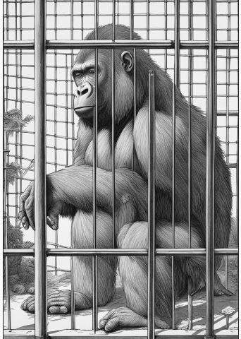
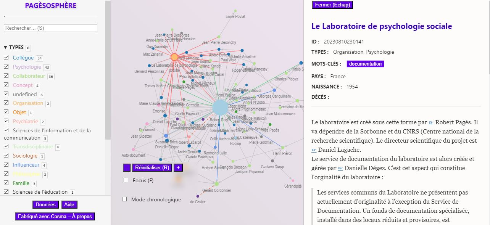
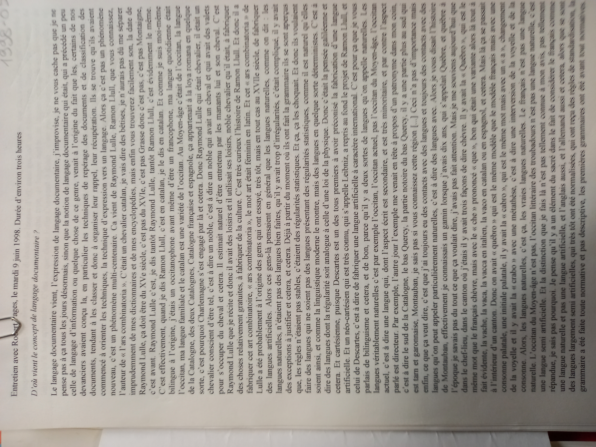

# Il faut revenir à Pagès
Olivier Le Deuff
2023 September 8th
*DOCAM*2023
 

---
## Briet and Pagès. 
The workshop's title alludes to Suzanne Briet's 1954 article, in which she declared,
> We must revisit Pagès. His message, at the time it was conveyed, did not receive the recognition it warranted, as there was no ready audience for it. (...) Pagès' dialectic and axioms are indisputably sound.
> Il faut en revenir à Pagès. Son message n'a pas eu, au moment où il l'a lancé, tout le retentissement qu'il méritait, parce qu'il ne trouva pas d'audience préparée à la recevoir. (...) La dialectique et les axiomes de PAGES sont absolument irréfutables.
    Briet, S (1954). Bibliothécaires et documentalistes. Revue de la documentation, 1954, no XXI, p. 43.
---
## Plan
1. Danielle Dégez and 'le laboratoire de psychologie sociale
2. Presentation of a work in progress : La pagèsphere
3. A treasure in the archives : an interview from 1998.

---
## 1.  Danièle Dégez and 'le laboratoire de psychologie sociale'
> This research laboratory was created and directed by Robert Pagès. It is affiliated with the Sorbonne and the CNRS (National Center for Scientific Research). The scientific director is Professor Lagache, a psychoanalyst.Personally, I completed all my psychology studies at the Sorbonne: a bachelor's degree and diplomas from the Institute of Psychology. In 1968, Pagès asked me to join his laboratory because I had ranked first in the social psychology certificate. In September 1968, I arrived at the laboratory, located in a small street near Les Halles, thinking I would be doing research. But Pagès told me: *"You will create and manage a documentation service."* I had no idea what that entailed. France, a few years after the end of the war, was far behind in this field. So, I bought books and journals, mainly in English, and discovered the CODOC and the system invented by the *engineer Cordonnier* called *"SELECTO."*

---

## CODOC and SELECTO
> This visual selection research system was essential for using the CODOC, a new language for psychology. The CODOC, consisting of vocabulary and syntax, allowed for the translation of all human science concepts. The task was to analyze all human science concepts by breaking down each word into its components, which were then translated into CODOC, an artificial language. This language is very complex.
> To simply explain the use of CODOC, here's an example: the translation of psychosociology: a (scientific study) 5 (focusing on) i (individual behavior) 4 (and) j (collective behavior) a, i, j are vocabulary words... 5 and 4 come from the syntax.

---
## Advantages of CODOC
> The advantage of this type of translation is the ability to find documents based on components of a word, such as individual behavior or collective behavior.
Although its benefits are clear, the difficulty of using CODOC led to its downfall, as it was never used by any other companies besides the social psychology laboratory. This technique, called "coded analysis," resulted in a few articles by Pagès and his team, *mainly published internally*.

---

## Rules of Codoc
> Pagès and his team also established rules for document analysis, in addition to content indexing by CODOC. This covered the bibliographic part: author's name, organization, language, date, places studied, period studied...This document analysis work, which seems obvious today, was *pioneering at a time when only classifications in libraries prevailed*.
---
## CNAM INTD
>In the 1960s, the training of documentalists was just beginning.Only the INTD (created in 1951) had some renown. The National Institute of Documentation Techniques, an institute of CNAM, trained generations of documentalists.
> It was Pagès, who taught at INTD, who asked me to replace him, and I succeeded him until my retirement years later.
---
## Training in CNAM
> The advanced cycle for students (mainly women) with a bachelor's degree (usually in literature) required an entrance exam, both oral and written. Theoretical courses, practical work, an internship, and a thesis occupied the academic year. Personally, I taught documentary languages and some concepts of business psychology. Groups of 3 or 4 students built thesauruses during practical work. I also supervised theses, some of which were of a very high standard. Gradually, most of the heads of documentation services came from the INTD, and many were part of the ADBS (Association of Specialized Documentalists and Librarians), an association that most information professionals belonged to, and of which I was president in the 1980s.

---
## A visionary
> It was important to highlight a visionary like Robert Pagès, whose work laid the foundation for modern documentation techniques. (Danielle Dégèz, august 2023)

---
## Some other points from my interview with Danièle Dégez
>we were a bit like a cult. (D. Dégez, 2022, May)
---

## 2. Pagès Network : The Pagèssphère
- From Otletosphère to Pagèsphère
- From Otletosphère to Cosma

[The work in progress](https://oledeuff.github.io/Pagesphere/pagesphere.html)

--- 
# 2. Pagesphere

---

## 2. Pagès Network : The Pagèsphère
- From Otletosphère to Pagèsphère
- From Otletosphère to Cosma

[The work in progress](https://oledeuff.github.io/Pagesphere/pagesphere.html)

---
## A man of concepts
- Towards a *Pagèslexis* with Cosma ?
> "Not to forget that, not understanding a single word of the neologisms that my father, the doctor of human sciences Robert P***, used both at home and in other seminars, I had promised him that the day he invented more obscure concepts than the Petit Robert dictionary had common nouns, I would have to commit him immediately, a threat that remained unfulfilled, due to never having the patience to count the unknown words that, by the thousands, had been added in the margins of the dictionaries stacked on his desk." (Yves Pagès, (2001). Le Théoriste. Paris: Verticales.)

---
## 3. A treasure in the archives : the interview

---
##

---
# A monolog
-  A document from june 1998, an interview with a student in sociology : Gaelle Millet.
 - A long monolog
 - He explained his relationship to documentation and 'langages documentaires'
 - There are passages between lucidity and delirium, reference to poetry, and a need to evoke his journey. He told that he forgot the rules of his code (CODOC).
 - The end of the document is full of poetry
 *17FP/493-494 Robert Pagès. 'Dossier pagès doc 90-2000'*
---
## Pagès's Perspective on Natural Languages and artificial languges
- Views them as artificially constructed due to introduced rules.
    -Orthographic decisions make languages artificial.
- Natural languages also have classificatory structures with word families.
- For him, natural languages are "sacralized"

---
## A bilingual perspective
>  comme je suis moi-même bilingue à l'origine, j'étais un occitanophone avant même d'être un francophone. Ma langue quotidienne était l'occitan
- He mentionned Esperanto, a language he learned at 20 but rarely used except for "love letters".

---

## The influence of Raymond LLul
- Llul was catalan like him
- Creator of a an artificial language
    - Ars combinatoria

---
## Leibniz'heritage
> It's natural that I found that pioneers, especially in the 19th century, continued the tradition of Leibniz, a tradition of a completely artificial language. But Leibniz's language was a total artificial language.
-Pagès appreciates Leibniz's classificatory logic, which involves mathematization.
> Admiration for Leibniz: "involved in all good tastes".
-19th-century pioneers continued Leibniz's tradition of a completely artificial language.
- Natural languages also have classificatory structures with word families.

---
## The influence of Cordonnier
> And then, people came along, information engineers, in France for example like, I forgot, I forgot *the name of the guy I was most inspired by, Cordonnier!* So, it's Cordonnier. And indeed, Cordonnier took up the Leibnizian idea, and I took up the Leibnizian idea from Cordonnier. And so he decided to create an artificial language, which would have the properties of an ordinary language, in which we could have tool-words. Tool words, there's a beginning of syntax in there, I didn't do all this by chance because it still sometimes helps me to classify my library.

---

## *ternary* numbers
> So Cordonnier's idea, which was a profound one, was to calculate, he was a French engineer, among the good engineers, he did a research thesis, and so he found that 2.71, that is, the number *e*, the base of the natural logarithms, was the most economical number of subdivisions. So, if we had listened to Cordonnier, we wouldn't have counted in bits, that is, in binary digits, that is, in binary numbers, but in ternary numbers, because the integer 3 is the closest to e, which is *2.71*, the base of the natural logarithms.

---

## Language as a *lattice* or *treillis*
- He discusses his inspiration from Cordonnier, considering that in practice the language was not tree-like for him but latticed like a lattice or trellis.

---
## How to classify Pagès
> I am a *bio-socio-psychologist*

---

## Briet and Pagès...
>We were *very close friends* with Madame Briet who was an admirer of Rimbaud, she thought I had a *Rimbaudian style*, at the time since I was a big runaway teenager since I was pursued by the Stalinists after the liberation, I was pursued by the Nazis and the Stalinists

> Nous étions *très copains avec Madame Briet* qui était une admiratrice de Rimbaud, elle trouvait que j'avais un style rimbaldien, à l'époque puisque j'étais un grand adolescent fuyard puisque j'étais poursuivi par les staliniens après la libération, j"étais poursuivi par les nazis et les staliniens
---
## We thank  :
- the *France-Berkeley Fund*
- Bibliothèque Henri Piéron
*17FP/493-494 Robert Pagès*

---

## Bonus. A poem by Pagès

"Sous un visage etale
le monde est emballé
on veut faire sa malle
chacun va s'en aller
Lire dans les etoiles
Où le marc de cafe
Le Web tisse sa Toile
en toile d'aragnee
et les soeurs filandieres
n'ont amas tant tissé
et taille des croupières
au globe apetissé."

---
## translation by ChatGpt
'''
Beneath a calm face,
The world is wrapped up.
Everyone wants to pack their bags,
Each one will leave.
Reading in the stars,
Or in the coffee grounds,
The Web weaves its Web,
Like a spider's web.
And the spinning sisters,
Have never woven so much,
And cut the hindquarters,
Of the appetizing globe.
''''
